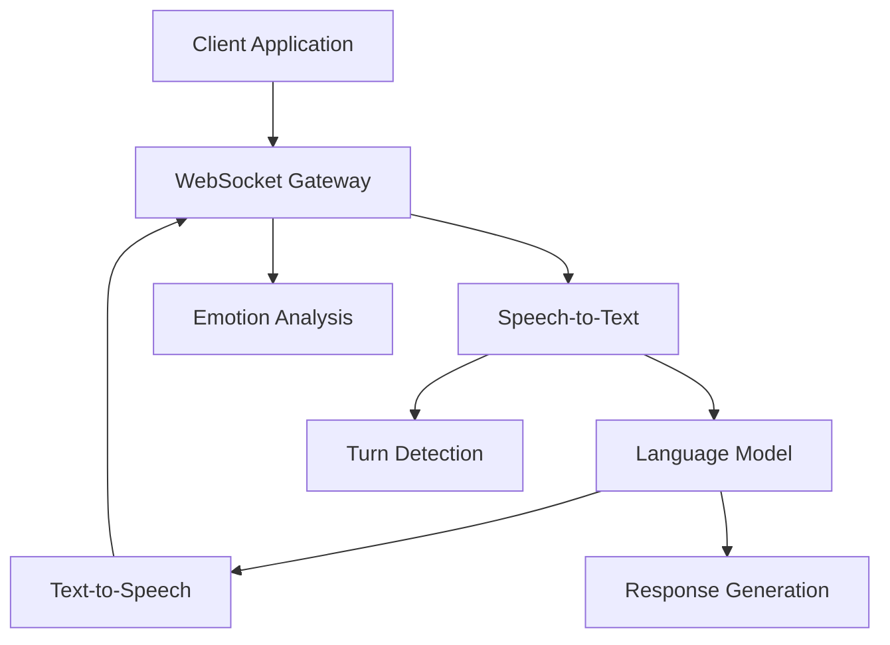

# Welcome to NextEVI

NextEVI is a comprehensive voice AI platform that enables developers to build sophisticated voice applications with real-time speech processing, natural language understanding, and expressive text-to-speech synthesis.

## What is NextEVI?

NextEVI combines cutting-edge AI technologies into a unified platform for voice-first applications:

- **Real-time Voice Processing**: WebSocket-based voice communication with streaming STT, LLM processing, and TTS synthesis
- **Multi-Engine TTS**: Choose from multiple high-quality text-to-speech engines optimized for different use cases
- **Emotion Recognition**: Real-time emotion analysis from speech for enhanced user experiences
- **Turn Detection**: Intelligent conversation flow management with interruption handling
- **Scalable Architecture**: Production-ready infrastructure supporting concurrent voice sessions

## Key Features

<CardGroup cols={2}>
  <Card title="Real-Time Voice Pipeline" icon="microphone" href="/websocket/introduction">
    Stream audio, get live transcriptions, and receive AI responses with minimal latency
  </Card>
  <Card title="Multiple TTS Engines" icon="volume-high" href="/tts/introduction">
    Orpheus, Parler, Kokoro, and Higgs engines for diverse voice synthesis needs
  </Card>
  <Card title="Emotion Recognition" icon="face-smile" href="/websocket/features/emotion-recognition">
    Analyze emotional context from speech for more engaging interactions
  </Card>
  <Card title="Interruption Handling" icon="hand" href="/websocket/interruption-handling">
    Natural conversation flow with intelligent turn-taking and interruption detection
  </Card>
</CardGroup>

## Use Cases

NextEVI powers a wide range of voice AI applications:

**Customer Service**: Build intelligent voice assistants that understand customer emotions and provide empathetic responses.

**Educational Platforms**: Create interactive learning experiences with real-time feedback and personalized voice interactions.

**Healthcare Applications**: Develop voice-enabled health monitoring tools with emotion-aware conversations.

**Entertainment & Gaming**: Build immersive voice characters with dynamic emotional expressions and natural conversation flow.

**Accessibility Tools**: Create voice-first interfaces that provide inclusive experiences for all users.

## Getting Started

<Steps>
  <Step title="Get Your API Key">
    Sign up for a NextEVI account and obtain your API credentials from the dashboard.
  </Step>
  <Step title="Choose Your Integration">
    Select between REST API for simple TTS or WebSocket API for real-time voice interactions.
  </Step>
  <Step title="Start Building">
    Use our SDKs and examples to quickly integrate voice AI into your application.
  </Step>
</Steps>

## Architecture Overview

NextEVI's architecture is designed for scalability and real-time performance:

## Next Steps

<CardGroup cols={3}>
  <Card title="Quick Start" icon="rocket" href="/quickstart">
    Get up and running with NextEVI in 5 minutes
  </Card>
  <Card title="TTS Services" icon="speaker-wave" href="/tts/getting-started">
    Explore our text-to-speech capabilities
  </Card>
  <Card title="Voice WebSocket" icon="bolt" href="/websocket/introduction">
    Build real-time voice applications
  </Card>
</CardGroup>

---

Ready to build the future of voice AI? Let's get started!