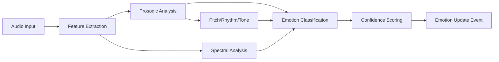

## Overview

NextEVI's emotion recognition system analyzes vocal patterns and speech characteristics to detect user emotions in real-time. This enables the AI to generate contextually appropriate and empathetic responses, creating more natural and engaging conversations.

<Info>
Emotion recognition is one of NextEVI's core differentiating features, providing deeper insight into user emotional state than traditional voice AI systems.
</Info>

## How It Works

### Vocal Analysis Pipeline



1. **Feature Extraction**: Extracts acoustic features from voice audio
2. **Prosodic Analysis**: Analyzes speech rhythm, stress, and intonation patterns  
3. **Spectral Analysis**: Examines frequency domain characteristics
4. **Emotion Classification**: Identifies specific emotions using ML models
5. **Confidence Scoring**: Provides reliability scores for detected emotions

### Supported Emotions

NextEVI detects the following emotions with confidence scores:

<CardGroup cols={3}>
  <Card title="Joy" icon="smile">
    Happiness, excitement, contentment
  </Card>
  <Card title="Sadness" icon="frown">
    Sorrow, disappointment, melancholy
  </Card>
  <Card title="Anger" icon="fire">
    Frustration, annoyance, irritation
  </Card>
  <Card title="Fear" icon="exclamation-triangle">
    Anxiety, worry, nervousness
  </Card>
  <Card title="Surprise" icon="bolt">
    Astonishment, shock, amazement
  </Card>
  <Card title="Disgust" icon="times-circle">
    Aversion, revulsion, distaste
  </Card>
  <Card title="Neutral" icon="minus">
    Calm, balanced emotional state
  </Card>
  <Card title="Empathy" icon="heart">
    Compassion, understanding, care
  </Card>
  <Card title="Confusion" icon="question-circle">
    Uncertainty, bewilderment, doubt
  </Card>
</CardGroup>

## Accessing Emotion Data

### React SDK Integration

Use the emotion data from voice messages:

```tsx
import React from 'react';
import { useVoice } from '@nextevi/voice-react';

function EmotionAwareChat() {
  const { messages, connect } = useVoice();
  
  const handleConnect = async () => {
    await connect({
      auth: {
        apiKey: "oak_your_api_key",
        projectId: "your-project-id",
        configId: "your-config-id"
      },
      // Enable emotion detection
      sessionSettings: {
        emotion_detection: {
          enabled: true,
          confidence_threshold: 0.7
        }
      }
    });
  };
  
  return (
    <div>
      <button onClick={handleConnect}>Start Emotion-Aware Chat</button>
      
      {messages.map(message => (
        <div key={message.id} className="message">
          <div className="content">{message.content}</div>
          
          {/* Display emotion data */}
          {message.metadata?.emotions && (
            <EmotionDisplay emotions={message.metadata.emotions} />
          )}
        </div>
      ))}
    </div>
  );
}

function EmotionDisplay({ emotions }) {
  const dominantEmotion = Object.entries(emotions)
    .reduce((a, b) => a[1] > b[1] ? a : b)[0];
  
  const emotionEmojis = {
    joy: '😊',
    sadness: '😢', 
    anger: '😠',
    fear: '😰',
    surprise: '😲',
    disgust: '🤢',
    neutral: '😐',
    empathy: '🤗',
    confusion: '🤔'
  };
  
  return (
    <div className="emotions">
      <span className="dominant">
        {emotionEmojis[dominantEmotion]} {dominantEmotion}
      </span>
      
      <div className="emotion-scores">
        {Object.entries(emotions).map(([emotion, score]) => (
          <div key={emotion} className="emotion-score">
            <span>{emotion}:</span>
            <div className="bar">
              <div 
                className="fill" 
                style={{ width: `${score * 100}%` }}
              />
            </div>
            <span>{(score * 100).toFixed(1)}%</span>
          </div>
        ))}
      </div>
    </div>
  );
}
```

### WebSocket Integration

Listen for emotion update events:

```javascript
const ws = new WebSocket('wss://api.nextevi.com/voice/websocket/conn-123');

ws.onmessage = (event) => {
  const message = JSON.parse(event.data);
  
  if (message.type === 'emotion_update') {
    const emotionData = message.data;
    
    console.log('Dominant emotion:', emotionData.dominant_emotion);
    console.log('Confidence:', emotionData.confidence);
    console.log('All emotions:', emotionData.emotions);
    
    // React to specific emotions
    handleEmotionChange(emotionData);
  }
};

function handleEmotionChange(emotionData) {
  const { dominant_emotion, confidence, emotions } = emotionData;
  
  // Only react to high-confidence emotions
  if (confidence < 0.7) return;
  
  switch (dominant_emotion) {
    case 'sadness':
      console.log('User seems sad, responding with empathy');
      // Trigger empathetic response or change conversation tone
      break;
      
    case 'anger':
      console.log('User seems frustrated, switching to calm tone');
      // Switch to de-escalation strategies
      break;
      
    case 'confusion':
      console.log('User seems confused, offering clarification');
      // Provide additional explanations
      break;
      
    case 'joy':
      console.log('User seems happy, matching positive energy');
      // Match enthusiasm level
      break;
  }
}
```

## Configuration Options

Configure emotion detection behavior:

### Session Settings

```json
{
  "type": "session_settings",
  "data": {
    "emotion_detection": {
      "enabled": true,
      "confidence_threshold": 0.7,
      "update_frequency": "continuous",
      "emotions_to_track": ["joy", "sadness", "anger", "neutral"],
      "analysis_window": 3.0
    }
  }
}
```

<ResponseField name="enabled" type="boolean" default="true">
  Enable/disable emotion detection
</ResponseField>

<ResponseField name="confidence_threshold" type="number" default="0.7">
  Minimum confidence score to trigger emotion updates (0-1)
</ResponseField>

<ResponseField name="update_frequency" type="string" default="continuous">
  Update frequency: "continuous", "on_turn_complete", "interval"
</ResponseField>

<ResponseField name="emotions_to_track" type="array">
  Specific emotions to monitor (empty array = all emotions)
</ResponseField>

<ResponseField name="analysis_window" type="number" default="3.0">
  Time window in seconds for emotion analysis
</ResponseField>

### React SDK Configuration

```tsx
const { connect } = useVoice();

await connect({
  auth: authConfig,
  sessionSettings: {
    emotion_detection: {
      enabled: true,
      confidence_threshold: 0.8,
      update_frequency: "continuous",
      analysis_window: 2.5
    }
  }
});
```

## Advanced Features

### Emotion History

Track emotion changes over time:

```tsx
import { useState, useEffect } from 'react';
import { useVoice } from '@nextevi/voice-react';

function EmotionHistoryTracker() {
  const { messages } = useVoice();
  const [emotionHistory, setEmotionHistory] = useState([]);
  
  useEffect(() => {
    // Extract emotions from messages
    const emotions = messages
      .filter(msg => msg.metadata?.emotions)
      .map(msg => ({
        timestamp: msg.timestamp,
        emotions: msg.metadata.emotions,
        dominant: getDominantEmotion(msg.metadata.emotions)
      }));
      
    setEmotionHistory(emotions);
  }, [messages]);
  
  const getDominantEmotion = (emotions) => {
    return Object.entries(emotions)
      .reduce((a, b) => a[1] > b[1] ? a : b)[0];
  };
  
  const getEmotionTrend = () => {
    if (emotionHistory.length < 2) return 'stable';
    
    const recent = emotionHistory.slice(-3);
    const positiveEmotions = ['joy', 'empathy'];
    const negativeEmotions = ['sadness', 'anger', 'fear'];
    
    const positiveCount = recent.filter(item => 
      positiveEmotions.includes(item.dominant)
    ).length;
    
    const negativeCount = recent.filter(item => 
      negativeEmotions.includes(item.dominant)
    ).length;
    
    if (positiveCount > negativeCount) return 'improving';
    if (negativeCount > positiveCount) return 'declining';
    return 'stable';
  };
  
  return (
    <div className="emotion-history">
      <h3>Emotion Trend: {getEmotionTrend()}</h3>
      
      <div className="timeline">
        {emotionHistory.map((item, index) => (
          <div key={index} className="emotion-point">
            <span className="time">
              {item.timestamp.toLocaleTimeString()}
            </span>
            <span className="emotion">{item.dominant}</span>
            <div className="confidence-bar">
              <div 
                className="fill"
                style={{ width: `${item.emotions[item.dominant] * 100}%` }}
              />
            </div>
          </div>
        ))}
      </div>
    </div>
  );
}
```

### Adaptive Response System

Create AI responses that adapt to user emotions:

```tsx
function AdaptiveVoiceAssistant() {
  const { messages, connectionMetadata } = useVoice();
  const [responseStyle, setResponseStyle] = useState('neutral');
  
  useEffect(() => {
    const recentEmotions = messages
      .slice(-3)
      .filter(msg => msg.type === 'user' && msg.metadata?.emotions)
      .map(msg => msg.metadata.emotions);
    
    if (recentEmotions.length > 0) {
      const avgEmotions = calculateAverageEmotions(recentEmotions);
      const newStyle = determineResponseStyle(avgEmotions);
      setResponseStyle(newStyle);
      
      // Send style preference to assistant
      updateAssistantStyle(newStyle);
    }
  }, [messages]);
  
  const calculateAverageEmotions = (emotionList) => {
    const avgEmotions = {};
    const emotionKeys = Object.keys(emotionList[0]);
    
    emotionKeys.forEach(emotion => {
      const sum = emotionList.reduce((acc, emotions) => 
        acc + emotions[emotion], 0
      );
      avgEmotions[emotion] = sum / emotionList.length;
    });
    
    return avgEmotions;
  };
  
  const determineResponseStyle = (avgEmotions) => {
    if (avgEmotions.sadness > 0.6) return 'empathetic';
    if (avgEmotions.anger > 0.5) return 'calming';
    if (avgEmotions.confusion > 0.5) return 'explanatory';
    if (avgEmotions.joy > 0.6) return 'enthusiastic';
    return 'neutral';
  };
  
  const updateAssistantStyle = (style) => {
    // Send system message to adjust response style
    const systemMessage = {
      type: "session_settings",
      data: {
        response_style: {
          tone: style,
          empathy_level: getEmpathyLevel(style),
          explanation_detail: getDetailLevel(style)
        }
      }
    };
    
    // Send via WebSocket if using direct connection
    // Or use SDK method if available
  };
  
  return (
    <div className="adaptive-assistant">
      <div className="current-style">
        Response Style: <strong>{responseStyle}</strong>
      </div>
      
      <div className="style-indicator">
        {getStyleIndicator(responseStyle)}
      </div>
    </div>
  );
}
```

### Emotion-Based Analytics

Track emotion patterns for analytics:

```tsx
function EmotionAnalytics() {
  const { messages } = useVoice();
  const [analytics, setAnalytics] = useState({});
  
  useEffect(() => {
    const emotionData = messages
      .filter(msg => msg.type === 'user' && msg.metadata?.emotions)
      .map(msg => msg.metadata.emotions);
    
    if (emotionData.length === 0) return;
    
    const stats = {
      totalMessages: emotionData.length,
      dominantEmotions: getDominantEmotions(emotionData),
      emotionDistribution: getEmotionDistribution(emotionData),
      emotionalJourney: getEmotionalJourney(emotionData),
      wellbeingScore: calculateWellbeingScore(emotionData)
    };
    
    setAnalytics(stats);
  }, [messages]);
  
  const getDominantEmotions = (emotionData) => {
    const counts = {};
    
    emotionData.forEach(emotions => {
      const dominant = Object.entries(emotions)
        .reduce((a, b) => a[1] > b[1] ? a : b)[0];
      counts[dominant] = (counts[dominant] || 0) + 1;
    });
    
    return Object.entries(counts)
      .sort(([,a], [,b]) => b - a)
      .slice(0, 3);
  };
  
  const calculateWellbeingScore = (emotionData) => {
    const positiveEmotions = ['joy', 'empathy'];
    const negativeEmotions = ['sadness', 'anger', 'fear'];
    
    let positiveSum = 0;
    let negativeSum = 0;
    
    emotionData.forEach(emotions => {
      positiveEmotions.forEach(emotion => {
        positiveSum += emotions[emotion] || 0;
      });
      
      negativeEmotions.forEach(emotion => {
        negativeSum += emotions[emotion] || 0;
      });
    });
    
    const total = positiveSum + negativeSum;
    return total > 0 ? (positiveSum / total) * 100 : 50;
  };
  
  return (
    <div className="emotion-analytics">
      <h3>Emotion Analytics</h3>
      
      <div className="wellbeing-score">
        Wellbeing Score: {analytics.wellbeingScore?.toFixed(1)}%
      </div>
      
      <div className="dominant-emotions">
        <h4>Top Emotions</h4>
        {analytics.dominantEmotions?.map(([emotion, count]) => (
          <div key={emotion}>
            {emotion}: {count} occurrences
          </div>
        ))}
      </div>
    </div>
  );
}
```

## Best Practices

<AccordionGroup>
  <Accordion title="Emotion Detection Accuracy" icon="bullseye">
    - Use confidence thresholds to filter low-quality detections
    - Consider cultural and individual differences in emotional expression
    - Combine emotion data with conversation context for better accuracy
    - Allow users to provide feedback on emotion detection accuracy
  </Accordion>
  
  <Accordion title="Privacy and Ethics" icon="shield-alt">
    - Always inform users that emotion detection is active
    - Provide options to disable emotion tracking
    - Don't make assumptions about user mental state based on single interactions
    - Respect user privacy and emotion data sensitivity
  </Accordion>
  
  <Accordion title="Response Adaptation" icon="sync-alt">
    - Make gradual adjustments rather than sudden tone changes
    - Maintain consistency with your brand voice
    - Provide fallback responses for uncertain emotion states
    - Test emotional response patterns with diverse user groups
  </Accordion>
  
  <Accordion title="Technical Implementation" icon="cogs">
    - Cache recent emotion data for trend analysis
    - Implement rate limiting for emotion-based actions
    - Handle emotion detection failures gracefully
    - Monitor emotion detection performance and accuracy
  </Accordion>
</AccordionGroup>

## Use Cases

### Customer Support

```tsx
// Detect customer frustration and escalate to human agent
function CustomerSupportBot() {
  const { messages } = useVoice();
  const [escalationTriggered, setEscalationTriggered] = useState(false);
  
  useEffect(() => {
    const recentUserMessages = messages
      .filter(msg => msg.type === 'user')
      .slice(-3);
    
    const highAngerMessages = recentUserMessages.filter(msg => 
      msg.metadata?.emotions?.anger > 0.7
    );
    
    if (highAngerMessages.length >= 2 && !escalationTriggered) {
      triggerHumanEscalation();
      setEscalationTriggered(true);
    }
  }, [messages]);
}
```

### Healthcare Assistant

```tsx
// Monitor emotional wellbeing during health consultations
function HealthcareAssistant() {
  const { messages } = useVoice();
  const [concerningPatterns, setConcerningPatterns] = useState([]);
  
  useEffect(() => {
    const emotionHistory = extractEmotionHistory(messages);
    const patterns = detectConcerningPatterns(emotionHistory);
    setConcerningPatterns(patterns);
    
    if (patterns.includes('persistent_sadness')) {
      suggestSupportResources();
    }
  }, [messages]);
}
```

### Educational Tutor

```tsx
// Adapt teaching approach based on student emotions
function AdaptiveTutor() {
  const { messages } = useVoice();
  const [teachingStyle, setTeachingStyle] = useState('standard');
  
  useEffect(() => {
    const recentEmotions = getRecentEmotions(messages);
    
    if (recentEmotions.confusion > 0.6) {
      setTeachingStyle('detailed_explanation');
    } else if (recentEmotions.boredom > 0.5) {
      setTeachingStyle('interactive_engagement');
    } else if (recentEmotions.joy > 0.7) {
      setTeachingStyle('accelerated_learning');
    }
  }, [messages]);
}
```

<Note>
Emotion recognition is a powerful feature that should be used responsibly. Always prioritize user privacy and provide clear information about how emotional data is used.
</Note>