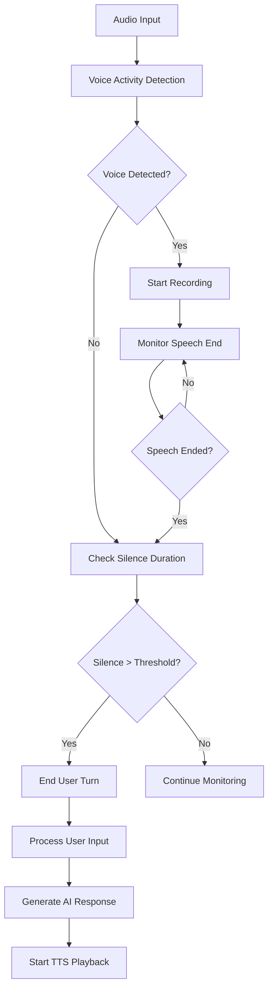

## Overview

NextEVI's turn detection system enables natural conversation flow by intelligently detecting when users start and stop speaking. This allows for seamless interruption handling, natural pauses, and smooth conversation transitions.

<Info>
Turn detection is crucial for creating natural-feeling voice conversations, preventing awkward overlaps and ensuring responsive AI interactions.
</Info>

## How Turn Detection Works

### Voice Activity Detection (VAD)



### Key Components

1. **Voice Activity Detection**: Identifies when user starts speaking
2. **Silence Detection**: Monitors for natural pause points
3. **Speech Confidence**: Validates detected speech quality
4. **Turn Timing**: Manages conversation flow timing
5. **Interruption Handling**: Manages when user interrupts AI response

## Configuration

### Basic Turn Detection Settings

```tsx
import { useVoice } from '@nextevi/voice-react';

function VoiceChatWithTurnDetection() {
  const { connect } = useVoice();
  
  const handleConnect = async () => {
    await connect({
      auth: {
        apiKey: "oak_your_api_key",
        projectId: "your_project_id", 
        configId: "your_config_id"
      },
      sessionSettings: {
        turn_detection: {
          enabled: true,
          silence_threshold: 0.5,        // Seconds of silence to end turn
          min_speaking_time: 0.3,        // Minimum speech duration
          speech_threshold: 0.3,         // Voice activity threshold
          interrupt_threshold: 0.8,      // Interrupt sensitivity
          natural_pauses: true           // Allow natural conversation pauses
        }
      }
    });
  };
  
  return (
    <div>
      <button onClick={handleConnect}>
        Start Turn-Aware Chat
      </button>
    </div>
  );
}
```

### Advanced Configuration

```json
{
  "type": "session_settings",
  "data": {
    "turn_detection": {
      "enabled": true,
      "mode": "adaptive",
      "silence_threshold": 0.8,
      "min_speaking_time": 0.5,
      "max_turn_duration": 30.0,
      "speech_threshold": 0.4,
      "interrupt_threshold": 0.7,
      "natural_pauses": true,
      "background_noise_adaptation": true,
      "speaking_rate_adaptation": true,
      "context_awareness": {
        "enabled": true,
        "conversation_style": "conversational",
        "user_preferences": "standard"
      }
    }
  }
}
```

<ResponseField name="enabled" type="boolean" default="true">
  Enable/disable turn detection
</ResponseField>

<ResponseField name="mode" type="string" default="standard">
  Detection mode: "standard", "adaptive", "aggressive", "conservative"
</ResponseField>

<ResponseField name="silence_threshold" type="number" default="0.5">
  Seconds of silence before ending user turn
</ResponseField>

<ResponseField name="min_speaking_time" type="number" default="0.3">
  Minimum speech duration to register as valid input
</ResponseField>

<ResponseField name="max_turn_duration" type="number" default="30.0">
  Maximum duration for a single turn
</ResponseField>

<ResponseField name="speech_threshold" type="number" default="0.3">
  Voice activity detection sensitivity (0-1)
</ResponseField>

<ResponseField name="interrupt_threshold" type="number" default="0.8">
  Sensitivity for detecting interruptions (0-1)
</ResponseField>

<ResponseField name="natural_pauses" type="boolean" default="true">
  Allow natural pauses without ending turn
</ResponseField>

## Turn Detection Events

### React SDK Integration

Monitor turn detection events:

```tsx
import { useVoice, useVoiceTurnDetection } from '@nextevi/voice-react';

function TurnAwareInterface() {
  const { messages, isRecording, isTTSPlaying } = useVoice();
  const { 
    isUserTurn, 
    isAssistantTurn, 
    turnDuration,
    silenceDuration 
  } = useVoiceTurnDetection();
  
  return (
    <div className="turn-aware-chat">
      <div className="turn-indicator">
        <div className={`user-turn ${isUserTurn ? 'active' : ''}`}>
          👤 Your turn {isUserTurn && `(${turnDuration.toFixed(1)}s)`}
        </div>
        
        <div className={`assistant-turn ${isAssistantTurn ? 'active' : ''}`}>
          🤖 Assistant turn {isTTSPlaying && '(speaking)'}
        </div>
        
        <div className="silence-indicator">
          {silenceDuration > 0 && (
            <span>Silence: {silenceDuration.toFixed(1)}s</span>
          )}
        </div>
      </div>
      
      <div className="recording-status">
        <div className={`mic-indicator ${isRecording ? 'recording' : ''}`}>
          {isRecording ? '🎤 Listening' : '🎤 Ready'}
        </div>
      </div>
      
      <div className="messages">
        {messages.map(message => (
          <MessageWithTurnInfo key={message.id} message={message} />
        ))}
      </div>
    </div>
  );
}

function MessageWithTurnInfo({ message }) {
  const turnInfo = message.metadata?.turnInfo;
  
  return (
    <div className="message">
      <div className="content">{message.content}</div>
      
      {turnInfo && (
        <div className="turn-metadata">
          <span>Duration: {turnInfo.duration}s</span>
          <span>Confidence: {turnInfo.confidence}</span>
          {turnInfo.interrupted && <span>⚠️ Interrupted</span>}
        </div>
      )}
    </div>
  );
}
```

### WebSocket Events

Listen for turn detection events:

```javascript
const ws = new WebSocket('wss://api.nextevi.com/ws/voice/conn-123?api_key=oak_your_api_key&config_id=your_config_id');

ws.onmessage = (event) => {
  const message = JSON.parse(event.data);
  
  switch (message.type) {
    case 'turn_start':
      handleTurnStart(message.data);
      break;
      
    case 'turn_end':
      handleTurnEnd(message.data);
      break;
      
    case 'turn_interrupted':
      handleTurnInterrupted(message.data);
      break;
      
    case 'voice_activity':
      handleVoiceActivity(message.data);
      break;
  }
};

function handleTurnStart(data) {
  console.log('User started speaking');
  
  // Stop any ongoing TTS if user interrupts
  if (data.interrupted_tts) {
    stopTTSPlayback();
  }
  
  // Show visual feedback
  showRecordingIndicator();
}

function handleTurnEnd(data) {
  console.log('User finished speaking');
  console.log('Turn duration:', data.duration);
  console.log('Speech confidence:', data.confidence);
  
  // Hide recording indicator
  hideRecordingIndicator();
  
  // Process the completed turn
  if (data.transcript) {
    displayUserMessage(data.transcript);
  }
}

function handleTurnInterrupted(data) {
  console.log('Turn was interrupted');
  console.log('Interruption type:', data.interruption_type);
  
  // Handle different interruption types
  switch (data.interruption_type) {
    case 'user_speech':
      // User started speaking while assistant was talking
      stopAssistantSpeech();
      break;
      
    case 'system_timeout':
      // Turn exceeded maximum duration
      processTurnTimeout();
      break;
      
    case 'silence_timeout':
      // Long pause detected
      processSilenceTimeout();
      break;
  }
}

function handleVoiceActivity(data) {
  // Real-time voice activity updates
  updateVoiceVisualization(data.activity_level);
  
  if (data.background_noise_level > 0.7) {
    showNoiseWarning();
  }
}
```

## Interruption Handling

### Types of Interruptions

<CardGroup cols={2}>
  <Card title="User Interruption" icon="user">
    User starts speaking while AI is responding
  </Card>
  <Card title="System Timeout" icon="clock">
    Turn exceeds maximum duration limit
  </Card>
  <Card title="Silence Timeout" icon="volume-mute">
    Extended silence detected during turn
  </Card>
  <Card title="Audio Quality" icon="exclamation-triangle">
    Poor audio quality interrupts processing
  </Card>
</CardGroup>

### Intelligent Interruption Response

```tsx
function SmartInterruptionHandler() {
  const { messages } = useVoice();
  const [interruptionCount, setInterruptionCount] = useState(0);
  const [adaptiveSettings, setAdaptiveSettings] = useState({
    interrupt_threshold: 0.8,
    silence_threshold: 0.5
  });
  
  useEffect(() => {
    const recentInterruptions = messages
      .filter(msg => msg.metadata?.interrupted)
      .slice(-5);
    
    setInterruptionCount(recentInterruptions.length);
    
    // Adapt sensitivity based on interruption patterns
    if (recentInterruptions.length > 3) {
      // User interrupts frequently - make less sensitive
      setAdaptiveSettings(prev => ({
        ...prev,
        interrupt_threshold: Math.min(prev.interrupt_threshold + 0.1, 1.0)
      }));
    } else if (recentInterruptions.length === 0) {
      // No interruptions - make more responsive
      setAdaptiveSettings(prev => ({
        ...prev,
        interrupt_threshold: Math.max(prev.interrupt_threshold - 0.1, 0.3)
      }));
    }
  }, [messages]);
  
  const updateTurnSettings = useCallback(async () => {
    // Send updated settings to session
    const settingsUpdate = {
      type: "session_settings",
      data: {
        turn_detection: adaptiveSettings
      }
    };
    
    // Send via WebSocket or SDK method
  }, [adaptiveSettings]);
  
  useEffect(() => {
    updateTurnSettings();
  }, [adaptiveSettings, updateTurnSettings]);
  
  return (
    <div className="interruption-handler">
      <div className="stats">
        Recent interruptions: {interruptionCount}
      </div>
      
      <div className="adaptive-settings">
        Interrupt sensitivity: {adaptiveSettings.interrupt_threshold}
      </div>
    </div>
  );
}
```

## Advanced Features

### Context-Aware Turn Detection

```tsx
function ContextAwareTurnDetection() {
  const { messages } = useVoice();
  const [conversationContext, setConversationContext] = useState('casual');
  
  useEffect(() => {
    // Analyze conversation to determine context
    const context = analyzeConversationContext(messages);
    setConversationContext(context);
    
    // Adjust turn detection based on context
    const contextSettings = getTurnSettingsForContext(context);
    updateTurnDetectionSettings(contextSettings);
  }, [messages]);
  
  const analyzeConversationContext = (messages) => {
    // Analyze recent messages for context clues
    const recentContent = messages
      .slice(-5)
      .map(msg => msg.content)
      .join(' ');
    
    if (recentContent.includes('urgent') || recentContent.includes('emergency')) {
      return 'urgent';
    } else if (recentContent.includes('explain') || recentContent.includes('help')) {
      return 'educational';
    } else if (recentContent.includes('sorry') || recentContent.includes('problem')) {
      return 'support';
    }
    
    return 'casual';
  };
  
  const getTurnSettingsForContext = (context) => {
    const settings = {
      casual: {
        silence_threshold: 0.8,
        interrupt_threshold: 0.7,
        natural_pauses: true
      },
      urgent: {
        silence_threshold: 0.3,
        interrupt_threshold: 0.9,
        natural_pauses: false
      },
      educational: {
        silence_threshold: 1.2,
        interrupt_threshold: 0.5,
        natural_pauses: true
      },
      support: {
        silence_threshold: 0.6,
        interrupt_threshold: 0.8,
        natural_pauses: true
      }
    };
    
    return settings[context] || settings.casual;
  };
}
```

### Multi-Speaker Detection

```tsx
function MultiSpeakerHandler() {
  const [speakers, setSpeakers] = useState([]);
  const [activeSpeaker, setActiveSpeaker] = useState(null);
  
  const handleSpeakerDetection = useCallback((data) => {
    if (data.type === 'speaker_change') {
      setActiveSpeaker(data.speaker_id);
      
      // Update speaker list if new speaker detected
      if (!speakers.find(s => s.id === data.speaker_id)) {
        setSpeakers(prev => [...prev, {
          id: data.speaker_id,
          confidence: data.confidence,
          characteristics: data.voice_characteristics
        }]);
      }
    }
  }, [speakers]);
  
  return (
    <div className="multi-speaker-interface">
      <div className="speakers">
        <h4>Detected Speakers:</h4>
        {speakers.map(speaker => (
          <div key={speaker.id} className={`speaker ${
            activeSpeaker === speaker.id ? 'active' : ''
          }`}>
            Speaker {speaker.id}
            {activeSpeaker === speaker.id && ' (speaking)'}
          </div>
        ))}
      </div>
    </div>
  );
}
```

### Turn Analytics

```tsx
function TurnAnalytics() {
  const { messages } = useVoice();
  const [analytics, setAnalytics] = useState({});
  
  useEffect(() => {
    const turnData = messages
      .filter(msg => msg.metadata?.turnInfo)
      .map(msg => msg.metadata.turnInfo);
    
    if (turnData.length === 0) return;
    
    const stats = {
      averageTurnDuration: calculateAverageDuration(turnData),
      interruptionRate: calculateInterruptionRate(turnData),
      silencePatterns: analyzeSilencePatterns(turnData),
      conversationPacing: analyzeConversationPacing(turnData)
    };
    
    setAnalytics(stats);
  }, [messages]);
  
  return (
    <div className="turn-analytics">
      <h3>Conversation Analytics</h3>
      
      <div className="stat">
        Average turn duration: {analytics.averageTurnDuration}s
      </div>
      
      <div className="stat">
        Interruption rate: {analytics.interruptionRate}%
      </div>
      
      <div className="stat">
        Conversation pacing: {analytics.conversationPacing}
      </div>
    </div>
  );
}
```

## Best Practices

<AccordionGroup>
  <Accordion title="Sensitivity Tuning" icon="sliders-h">
    - Start with conservative settings and adjust based on user behavior
    - Account for different speaking styles and speeds
    - Consider background noise levels in the user's environment
    - Test with diverse accents and languages
  </Accordion>
  
  <Accordion title="User Experience" icon="user-check">
    - Provide clear visual feedback for turn states
    - Handle interruptions gracefully without jarring stops
    - Allow users to adjust sensitivity settings
    - Provide helpful error messages for turn detection issues
  </Accordion>
  
  <Accordion title="Performance Optimization" icon="tachometer-alt">
    - Use efficient voice activity detection algorithms
    - Minimize latency between turn detection and response
    - Optimize for mobile devices with limited processing power
    - Monitor and adjust settings based on connection quality
  </Accordion>
  
  <Accordion title="Accessibility" icon="universal-access">
    - Support users with different speech patterns
    - Provide alternative input methods for users who cannot speak clearly
    - Consider cognitive load in turn timing decisions
    - Allow customization for users with disabilities
  </Accordion>
</AccordionGroup>

## Troubleshooting

### Common Issues

<AccordionGroup>
  <Accordion title="Frequent False Starts" icon="exclamation-triangle">
    **Problem**: Turn detection triggers on background noise
    
    **Solutions**:
    - Increase speech_threshold value
    - Enable background_noise_adaptation
    - Increase min_speaking_time
    - Use noise cancellation on client side
  </Accordion>
  
  <Accordion title="Delayed Turn Detection" icon="clock">
    **Problem**: System doesn't detect when user stops speaking
    
    **Solutions**:
    - Decrease silence_threshold
    - Adjust for user's natural speaking pace
    - Check audio quality and connection stability
    - Verify microphone sensitivity
  </Accordion>
  
  <Accordion title="Excessive Interruptions" icon="hand-paper">
    **Problem**: AI gets interrupted too frequently
    
    **Solutions**:
    - Increase interrupt_threshold
    - Enable natural_pauses
    - Adjust TTS speed and pacing
    - Implement interrupt recovery strategies
  </Accordion>
  
  <Accordion title="Poor Audio Quality Detection" icon="volume-down">
    **Problem**: Turn detection fails with poor audio
    
    **Solutions**:
    - Implement audio quality monitoring
    - Provide audio setup guidance to users
    - Use adaptive thresholds based on audio quality
    - Enable client-side audio preprocessing
  </Accordion>
</AccordionGroup>

<Note>
Turn detection performance varies significantly based on user environment, speaking style, and audio quality. Always provide fallback mechanisms and user controls for optimal experience.
</Note>