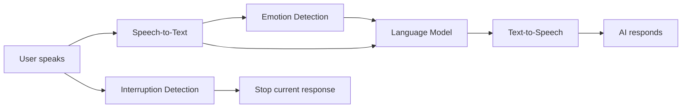

# NextEVI Speech-to-Speech (EVI)

NextEVI's Speech-to-Speech platform enables natural, full-duplex voice conversations between users and AI assistants with built-in emotion recognition and empathetic responses.

<CardGroup cols={2}>
  <Card title="Real-time Voice" icon="microphone">
    Full-duplex voice communication with sub-200ms latency
  </Card>
  <Card title="Emotion Recognition" icon="heart">
    Real-time emotion detection and empathic AI responses
  </Card>
  <Card title="Natural Conversations" icon="comments">
    Advanced turn detection and interruption handling
  </Card>
  <Card title="Easy Integration" icon="code">
    React SDK and WebSocket API for seamless integration
  </Card>
</CardGroup>

## How It Works

## Core Capabilities

### **Empathic AI Features**
- **Real-time Emotion Detection**: Analyzes vocal patterns to detect emotions like joy, sadness, anger, and surprise
- **Empathic Responses**: AI generates contextually appropriate responses based on detected emotions
- **Vocal Modulation Analysis**: Advanced processing of speech patterns beyond just words

### **Advanced Voice Processing**
- **Speech-to-Text (STT)**: High-accuracy transcription with real-time streaming
- **Large Language Model**: Intelligent response generation with context awareness
- **Text-to-Speech (TTS)**: Natural-sounding voice synthesis with multiple voice options
- **Audio Processing**: Echo cancellation, noise suppression, and audio optimization

### **Real-time Communication**
- **WebSocket-based**: Low-latency bidirectional communication
- **Interruption Handling**: Natural conversation flow with intelligent TTS interruption
- **Turn Detection**: Automatic detection of speaking turns and pauses
- **Streaming Responses**: Real-time response generation and delivery

## Use Cases

<AccordionGroup>
  <Accordion title="Customer Support" icon="headset">
    Create empathetic customer service agents that understand emotional context and respond appropriately to frustrated or confused customers.
  </Accordion>
  
  <Accordion title="Digital Companions" icon="robot">
    Build AI companions for elderly care, mental health support, or general companionship with emotional intelligence.
  </Accordion>
  
  <Accordion title="Educational Assistants" icon="graduation-cap">
    Develop tutoring systems that adapt their teaching style based on student engagement and emotional state.
  </Accordion>
  
  <Accordion title="Healthcare Applications" icon="medical">
    Create patient-facing applications that provide emotional support during medical consultations or therapy sessions.
  </Accordion>
  
  <Accordion title="Entertainment & Gaming" icon="gamepad">
    Integrate emotional AI characters that respond dynamically to player emotions and create immersive experiences.
  </Accordion>
</AccordionGroup>

## Integration Options

<CardGroup cols={3}>
  <Card title="React SDK" icon="react" href="/speech-to-speech/react-sdk/installation">
    **Recommended for React apps**
    
    Complete hooks-based integration with TypeScript support and built-in state management.
  </Card>
  <Card title="WebSocket API" icon="plug" href="/speech-to-speech/websocket-api/connection">
    **For any platform**
    
    Direct WebSocket integration for maximum control and cross-platform compatibility.
  </Card>
  <Card title="LiveKit Integration" icon="microphone-lines" href="/speech-to-speech/livekit-integration/installation">
    **For LiveKit agents**
    
    Seamless integration with LiveKit Agents for real-time voice applications and playground testing.
  </Card>
</CardGroup>

## Next Steps

<Steps>
  <Step title="Quick Start">
    [Get your first voice chat running in 5 minutes](/quickstart)
  </Step>
  <Step title="Choose Integration">
    Pick [React SDK](/speech-to-speech/react-sdk/installation) or [WebSocket API](/speech-to-speech/websocket-api/connection)
  </Step>
  <Step title="Add Advanced Features">
    Explore [emotion recognition](/speech-to-speech/features/emotions) and [turn detection](/speech-to-speech/features/turn-detection)
  </Step>
  <Step title="Authentication">
    Set up [secure authentication](/speech-to-speech/authentication) for production
  </Step>
</Steps>

## Developer Resources

<CardGroup cols={2}>
  <Card title="API Reference" icon="book" href="/api-reference/websocket">
    Complete WebSocket API documentation
  </Card>
  <Card title="Error Handling" icon="exclamation-triangle" href="/api-reference/errors">
    Common errors and troubleshooting
  </Card>
</CardGroup>