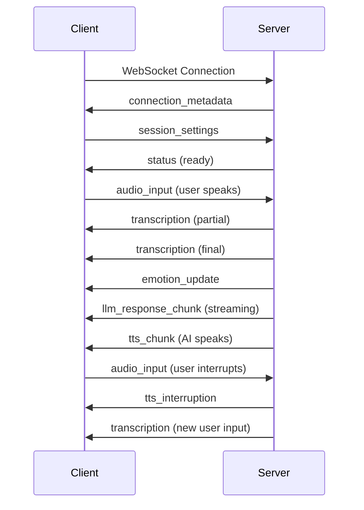
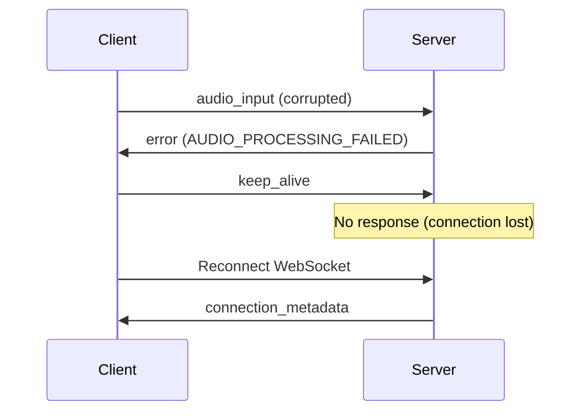

# WebSocket Message Protocol

This guide covers the complete message protocol for NextEVI's WebSocket API, including message types, data formats, and communication patterns.

## Message Format

All messages use consistent JSON structure:

```json
{
  "type": "message_type",
  "timestamp": 1645123456.789,
  "message_id": "uuid-string",
  "data": {
    // Message-specific payload
  }
}
```

<ParamField body="type" type="string" required>
  Message type identifier
</ParamField>

<ParamField body="timestamp" type="number" required>
  Unix timestamp in seconds with millisecond precision
</ParamField>

<ParamField body="message_id" type="string" required>
  Unique identifier for this message (UUID recommended)
</ParamField>

<ParamField body="data" type="object">
  Message-specific data payload
</ParamField>

---

## Client-to-Server Messages

### Session Settings

Configure audio settings and enable features:

```json
{
  "type": "session_settings",
  "timestamp": 1645123456.789,
  "message_id": "settings-1",
  "data": {
    "emotion_detection": { "enabled": true },
    "turn_detection": { "enabled": true, "silence_threshold": 0.5 },
    "audio": { 
      "sample_rate": 24000, 
      "channels": 1, 
      "encoding": "linear16" 
    }
  }
}
```

<Expandable title="Session Settings Parameters">
  <ParamField body="emotion_detection" type="object">
    - `enabled` (boolean): Enable real-time emotion detection
  </ParamField>
  
  <ParamField body="turn_detection" type="object">
    - `enabled` (boolean): Enable intelligent turn detection
    - `silence_threshold` (number): Silence duration to detect turn end (seconds)
  </ParamField>
  
  <ParamField body="audio" type="object">
    - `sample_rate` (number): Audio sample rate (24000 recommended)
    - `channels` (number): Audio channels (1 for mono)
    - `encoding` (string): Audio encoding format ("linear16")
  </ParamField>
</Expandable>

### Audio Input

Send audio data for processing:

```json
{
  "type": "audio_input",
  "timestamp": 1645123456.789,
  "message_id": "audio-1",
  "data": {
    "audio": "base64-encoded-audio-data",
    "chunk_id": "chunk-001"
  }
}
```

<Expandable title="Audio Input Parameters">
  <ParamField body="audio" type="string" required>
    Base64-encoded PCM audio data (16-bit, mono, 24kHz)
  </ParamField>
  
  <ParamField body="chunk_id" type="string">
    Optional identifier for audio chunk ordering
  </ParamField>
</Expandable>

### Keep Alive

Maintain connection during idle periods:

```json
{
  "type": "keep_alive",
  "timestamp": 1645123456.789,
  "message_id": "ping-1"
}
```

---

## Server-to-Client Messages

### Connection Metadata

Sent immediately after successful connection:

```json
{
  "type": "connection_metadata",
  "timestamp": 1645123456.789,
  "message_id": "meta-1",
  "data": {
    "connection_id": "conn-xyz789",
    "status": "connected",
    "config": {
      "audio_format": "pcm_24khz_16bit_mono",
      "encoding": "linear16",
      "sample_rate": 24000,
      "channels": 1
    },
    "project_id": "project-123",
    "config_id": "config-abc"
  }
}
```

### Transcription

Real-time speech-to-text results:

```json
{
  "type": "transcription",
  "timestamp": 1645123456.789,
  "message_id": "transcript-1",
  "data": {
    "transcript": "Hello, how can I help you today?",
    "confidence": 0.95,
    "is_final": true,
    "is_speech_final": true,
    "session_id": "conn-xyz789",
    "words": [
      {
        "word": "Hello",
        "start": 1.2,
        "end": 1.6,
        "confidence": 0.98
      }
    ],
    "accumulated_transcript": "Hello, how can I help you today?",
    "is_turn_incomplete": false,
    "original_fragment": "Hello, how can I help you today?"
  }
}
```

<Expandable title="Transcription Parameters">
  <ParamField body="transcript" type="string">
    Transcribed text from speech
  </ParamField>
  
  <ParamField body="confidence" type="number">
    Transcription confidence score (0-1)
  </ParamField>
  
  <ParamField body="is_final" type="boolean">
    Whether this transcription is final or partial
  </ParamField>
  
  <ParamField body="is_speech_final" type="boolean">
    Whether the user has finished speaking
  </ParamField>
  
  <ParamField body="words" type="array">
    Word-level timing and confidence information
  </ParamField>
  
  <ParamField body="accumulated_transcript" type="string">
    Complete accumulated text for this conversation turn
  </ParamField>
  
  <ParamField body="is_turn_incomplete" type="boolean">
    Whether the user's turn is still continuing
  </ParamField>
</Expandable>

### LLM Response Chunk

Streaming text responses from the language model:

```json
{
  "type": "llm_response_chunk",
  "timestamp": 1645123456.789,
  "message_id": "llm-chunk-1",
  "data": {
    "content": "I'd be happy to help you with",
    "is_final": false,
    "generation_id": "gen-abc123",
    "chunk_index": 1
  }
}
```

### TTS Audio Chunk

Audio response chunks for playback:

```json
{
  "type": "tts_chunk",
  "timestamp": 1645123456.789,
  "message_id": "tts-1",
  "content": "base64-encoded-audio-data"
}
```

### Emotion Update

Real-time emotion detection results:

```json
{
  "type": "emotion_update",
  "timestamp": 1645123456.789,
  "message_id": "emotion-1",
  "data": {
    "top_emotions": [
      { "name": "Joy", "score": 0.85 },
      { "name": "Excitement", "score": 0.72 }
    ],
    "all_emotions": {
      "Joy": 0.85,
      "Sadness": 0.12,
      "Anger": 0.03,
      "Fear": 0.05,
      "Surprise": 0.15,
      "Disgust": 0.02,
      "Contempt": 0.01,
      "Excitement": 0.72,
      "Calmness": 0.45
    },
    "processing_time": 0.045,
    "utterance_duration": 2.3,
    "connection_id": "conn-xyz789",
    "session_id": "conn-xyz789"
  }
}
```

<Expandable title="Emotion Parameters">
  <ParamField body="top_emotions" type="array">
    Top detected emotions with confidence scores
  </ParamField>
  
  <ParamField body="all_emotions" type="object">
    Complete emotion analysis results
  </ParamField>
  
  <ParamField body="processing_time" type="number">
    Time taken to process emotion detection (seconds)
  </ParamField>
  
  <ParamField body="utterance_duration" type="number">
    Duration of analyzed speech segment (seconds)
  </ParamField>
</Expandable>

### Turn Detection Events

Conversation turn management:

```json
{
  "type": "turn_start",
  "timestamp": 1645123456.789,
  "message_id": "turn-1",
  "data": {
    "turn_id": "turn-abc123"
  }
}
```

```json
{
  "type": "turn_end",
  "timestamp": 1645123456.789,
  "message_id": "turn-2",
  "data": {
    "turn_id": "turn-abc123",
    "duration": 3.2,
    "is_complete": true
  }
}
```

### TTS Interruption

Indicates AI speech was interrupted:

```json
{
  "type": "tts_interruption",
  "timestamp": 1645123456.789,
  "message_id": "interrupt-1",
  "content": ""
}
```

### Status Messages

System status updates:

```json
{
  "type": "status",
  "timestamp": 1645123456.789,
  "message_id": "status-1",
  "data": {
    "status": "ready",
    "details": {
      "session_settings": {
        "sample_rate": 24000,
        "channels": 1,
        "encoding": "linear16"
      }
    }
  }
}
```

### Error Messages

Error notifications:

```json
{
  "type": "error",
  "timestamp": 1645123456.789,
  "message_id": "error-1",
  "data": {
    "error_code": "AUDIO_PROCESSING_FAILED",
    "error_message": "Failed to process audio chunk",
    "details": {
      "chunk_id": "chunk-001"
    }
  }
}
```

---

## Binary Audio Messages

For efficiency, audio can be sent as binary WebSocket messages instead of base64-encoded JSON. Send raw PCM audio data (16-bit, mono, 24kHz) directly as binary frames.

```javascript
// Send binary audio
const audioBuffer = new Int16Array(audioSamples);
websocket.send(audioBuffer.buffer);
```

---

## Message Flow Examples

### Basic Voice Conversation



### Error Handling



## Best Practices

### Message IDs
- Use UUIDs for message_id fields
- Include sequence numbers for audio chunks
- Track message correlation for debugging

### Error Handling
- Implement exponential backoff for reconnections
- Handle partial message scenarios
- Log all error messages for debugging

### Performance
- Send audio in 100-200ms chunks for optimal latency
- Use binary messages for audio when possible
- Implement client-side audio buffering

## Next Steps

<CardGroup cols={2}>
  <Card title="Connection Examples" icon="code" href="/speech-to-speech/websocket-api/examples">
    See complete working examples
  </Card>
  <Card title="Error Reference" icon="exclamation-triangle" href="/api-reference/errors">
    Common errors and solutions
  </Card>
</CardGroup>